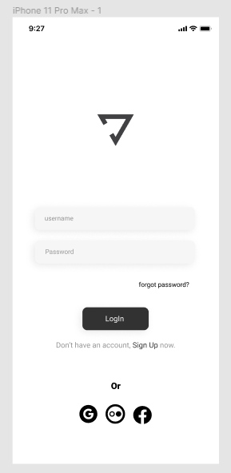

# Yoga Interface

> Projeto Yoga finalizado

### 🛠️ Ajustes e melhorias:

O projeto ainda está em desenvolvimento e as próximas atualizações serão voltadas nas seguintes tarefas:

- [x] Utilização do HTML
- [x] Utilização do CSS
- [ ] Alteração do Layout

### 🤝 Desenvolvido por:

Agradecemos às seguintes pessoas que contribuíram para este projeto:

<table>
  <tr>
    <td align="center">
      <a href="https://www.linkedin.com/in/jos%C3%A9-nataniel-4764a4224/">
         
        
          <b>Nataniel Andrade</b>
        
      </a>
  </tr>
</table>

[⬆ Voltar ao topo](#yoga-interface) 

 
